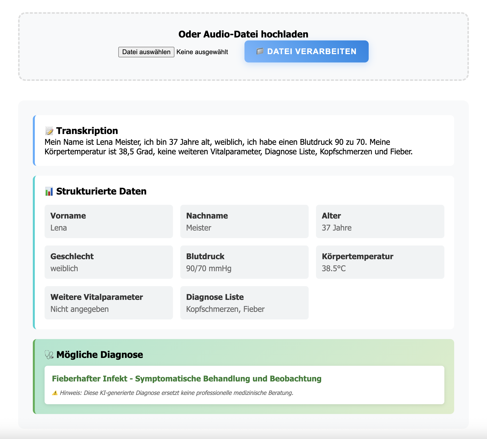

# Speech-to-Structure

Eine Node.js-Anwendung, die Audio-Aufnahmen mit Whisper-Tiny transkribiert und mit GPT-OSS:20B in strukturierte JSON-Daten umwandelt.

# Screenshot



- Das Resultat ist noch fehlerhaft Verbesserungsvorschläge gerne an <a href="mailto:7starch@gmail.com">Peter</a>.
Bessere Resultate erzielt man wenn der Plaintext angeben wird. Franz Beckenbauer 120 80 etc.
## Features

- 🎤 **Audio-Aufnahme**: Direkte Aufnahme über das Web-Interface
- 📁 **Datei-Upload**: Upload bestehender Audio-Dateien
- 🔄 **Lokale Speech-to-Text**: Transkription mit Python faster-whisper (small-Modell)
- 🎵 **Audio-Konvertierung**: Automatische Konvertierung zu 16kHz mono WAV (FFmpeg)
- 🧠 **Lokale KI-Strukturierung**: Automatische Kategorisierung mit GPT-OSS:20B (Ollama)
- � **Intelligente Datenkorrektur**: Automatische Korrektur von Transkriptionsfehlern
- 📝 **Medizinische Textverarbeitung**: Erkennung und Formatierung medizinischer Begriffe
- �📊 **JSON-Ausgabe**: Strukturierte Daten nach medizinischen Kategorien
- 🗑️ **Automatische Bereinigung**: Audio-Dateien werden nach Verarbeitung automatisch gelöscht

## Strukturierte Kategorien

Die App kategorisiert und korrigiert Audio-Inhalte automatisch nach:
- **Vorname**: Erkennt deutsche Vornamen, auch bei Transkriptionsfehlern
- **Nachname**: Extrahiert Familiennamen aus dem Kontext  
- **Alter**: Konvertiert Zahlwörter ("fünfzig Jahre" → "50")
- **Geschlecht**: Erkennt "männlich/weiblich/divers" in verschiedenen Formulierungen
- **Blutdruck**: Korrigiert Werte ("einhundertdreißig zu achtzig" → "130/80 mmHg")
- **Körpertemperatur**: Formatiert Temperaturen ("achtunddreißig Grad" → "38.0°C")
- **Weitere Vitalparameter**: Puls, Sauerstoffsättigung, Atemfrequenz etc.
- **Diagnose Liste (1-5)**: Medizinische Diagnosen, Symptome, Beschwerden

### Beispiel-Eingabe:
*"Hallo, mein Name ist Max Mustermann, ich bin fünfzig Jahre alt, männlich. Mein Blutdruck ist einhundertdreißig zu achtzig, Temperatur achtunddreißig Komma fünf Grad. Ich habe Kopfschmerzen und Fieber."*

### Beispiel-Ausgabe:
```json
{
  "vorname": "Max",
  "nachname": "Mustermann",
  "alter": "50", 
  "geschlecht": "männlich",
  "blutdruck": "130/80 mmHg",
  "koerpertemperatur": "38.5°C",
  "weitere_vitalparameter": [],
  "diagnose_liste": ["Kopfschmerzen", "Fieber"]
}
```

## Installation

### Voraussetzungen

- **Node.js** (v18 oder höher)
- **Python** (v3.8 oder höher)
- **FFmpeg** (für Audio-Konvertierung)
- **Ollama** (für lokale LLM-Integration)

### 1. Repository klonen
```bash
git clone <repository-url>
cd speech-to-structure
```

### 2. Node.js-Abhängigkeiten installieren
```bash
npm install
```

### 3. Python Virtual Environment einrichten
```bash
# Virtual Environment erstellen
python3 -m venv .venv

# Virtual Environment aktivieren
# Linux/macOS:
source .venv/bin/activate
# Windows:
# .venv\Scripts\activate

# Python-Abhängigkeiten installieren
pip install faster-whisper
```

### 4. FFmpeg installieren

**macOS (mit Homebrew):**
```bash
brew install ffmpeg
```

**Ubuntu/Debian:**
```bash
sudo apt update
sudo apt install ffmpeg
```

**Windows:**
- Lade FFmpeg von https://ffmpeg.org/download.html herunter
- Füge FFmpeg zum PATH hinzu

### 5. Ollama installieren und Modelle laden
```bash
# Ollama installieren (macOS/Linux)
curl -fsSL https://ollama.ai/install.sh | sh

# Ollama starten
ollama serve &

# GPT-OSS:20B Modell laden (13 GB)
ollama pull gpt-oss:20b

# Alternative: Kleineres Modell für Tests
ollama pull llama3:8b
```

### 6. Umgebungsvariablen konfigurieren
```bash
cp .env.example .env
```

Bearbeite die `.env`-Datei und passe die Pfade an:
```bash
# Python-Integration für faster-whisper
PYTHON_BIN=/path/to/your/project/.venv/bin/python
WHISPER_MODEL_SIZE=small

# GPT-OSS:20B Konfiguration  
GPT_OSS_ENDPOINT=http://localhost:11434/api/generate

# Server Port
PORT=3000
```

### 7. Server starten
```bash
# Python Virtual Environment aktivieren (falls nicht bereits aktiv)
source .venv/bin/activate

# Server starten
npm start
```

### 8. Anwendung öffnen
Öffne `http://localhost:3000` in deinem Browser

## API-Konfiguration

### Python faster-whisper (Lokal)
Vollständig installiert und konfiguriert:
- **faster-whisper**: Lokale Speech-to-Text Transkription (244 MB small-Modell)
- **FFmpeg**: Audio-Konvertierung zu 16kHz mono WAV
- **Python Virtual Environment**: Isolierte Python-Umgebung

### Ollama (Lokal)  
Bereits installierte Modelle:
- **gpt-oss:20b**: Lokale Text-zu-JSON Strukturierung (13 GB)
- **llama3:8b**: Alternative für Strukturierung (4.7 GB)

## Verwendung

1. **Audio aufnehmen**:
   - Klicke auf "Aufnahme starten"
   - Spreche den zu strukturierenden Text
   - Klicke auf "Aufnahme beenden"

2. **Datei hochladen**:
   - Wähle eine Audio-Datei aus
   - Klicke auf "Datei verarbeiten"

3. **Ergebnis betrachten**:
   - Die Transkription wird angezeigt
   - Die strukturierten Daten erscheinen in kategorisierter Form

## Unterstützte Audio-Formate

- **Eingabe**: WAV, MP3, M4A, OGG, FLAC, WEBM
- **Intern konvertiert zu**: 16kHz mono WAV (optimal für Whisper)
- **Maximale Dateigröße**: 25MB

## Entwicklung

### Development Server starten
```bash
# Python Virtual Environment aktivieren
source .venv/bin/activate

# Server im Entwicklungsmodus starten
npm run dev
```

### Tests ausführen
```bash
# Python-Whisper testen
source .venv/bin/activate
python transcribe.py test.wav  # (benötigt eine test.wav Datei)

# Server-Health-Check
curl http://localhost:3000/health
```

### Troubleshooting

#### Python-Umgebung
```bash
# Virtual Environment neu erstellen
rm -rf .venv
python3 -m venv .venv
source .venv/bin/activate
pip install faster-whisper
```

#### FFmpeg-Probleme
```bash
# FFmpeg-Version überprüfen
ffmpeg -version

# Pfad überprüfen
which ffmpeg
```

#### Ollama-Probleme
```bash
# Ollama-Status überprüfen
ollama list

# Ollama neu starten
ollama serve

# Modell-Status überprüfen
curl http://localhost:11434/api/tags
```

## Technologie-Stack

- **Backend**: Node.js, Express.js
- **Frontend**: Vanilla HTML/CSS/JavaScript
- **Audio-Verarbeitung**: Web Audio API, MediaRecorder
- **Audio-Konvertierung**: FFmpeg (über fluent-ffmpeg)
- **File-Upload**: Multer
- **Speech-to-Text**: Python faster-whisper (OpenAI Whisper)
- **Text-Strukturierung**: Ollama GPT-OSS:20B
- **Python Integration**: child_process execFile

## Troubleshooting

### Python-Umgebung Probleme
- Stelle sicher, dass die virtuelle Umgebung aktiviert ist: `source .venv/bin/activate`
- Überprüfe den Python-Pfad in der `.env`-Datei
- Installiere faster-whisper neu: `pip install --upgrade faster-whisper`

### Audio-Verarbeitungsfehler
- Überprüfe die Audio-Qualität und -format
- Stelle sicher, dass FFmpeg installiert ist
- Maximale Dateigröße: 25MB

### Transkriptionsfehler
- Das erste Mal dauert länger (Modell wird heruntergeladen: ~75MB)
- Überprüfe die Python-Umgebung und faster-whisper Installation
- Prüfe die Netzwerkverbindung für den ersten Model-Download

### GPT-Strukturierungsfehler
- Überprüfe ob Ollama läuft: `ollama serve`
- Stelle sicher, dass gpt-oss:20b installiert ist: `ollama pull gpt-oss:20b`
- Prüfe die API-Verbindung: `curl http://localhost:11434/api/tags`

## Lizenz

MIT License

## Autor

Erstellt mit KI
